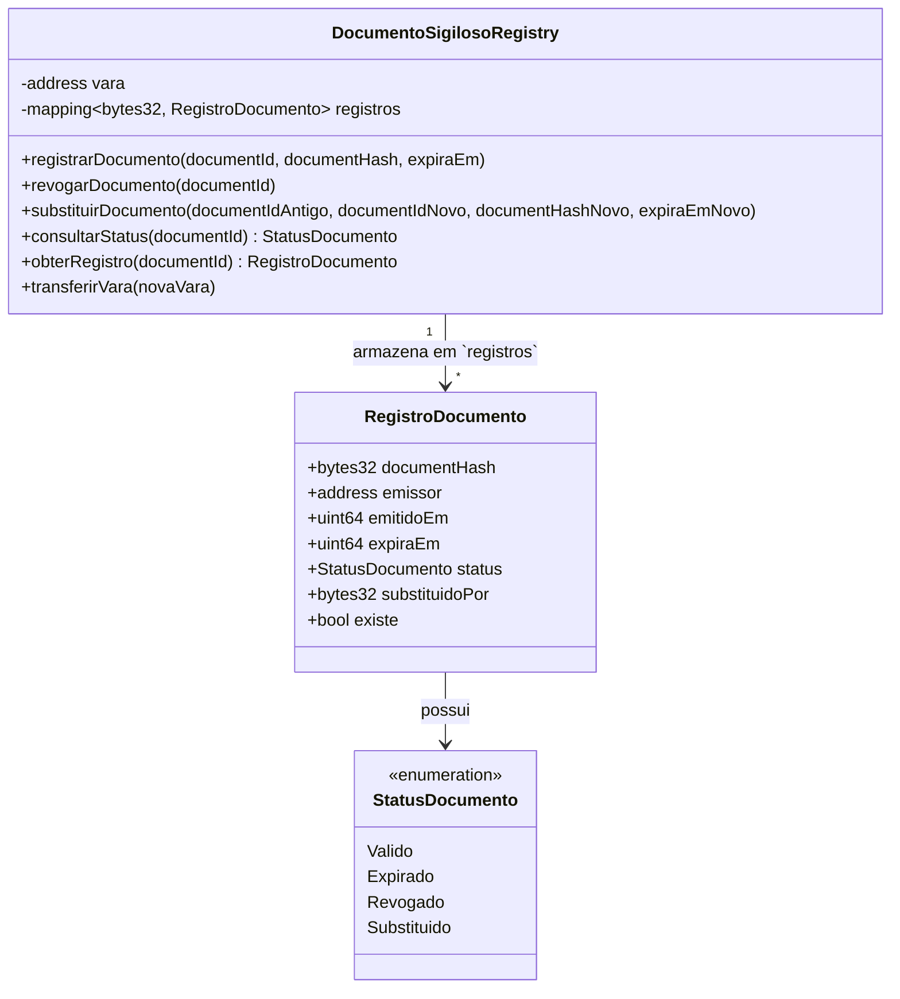
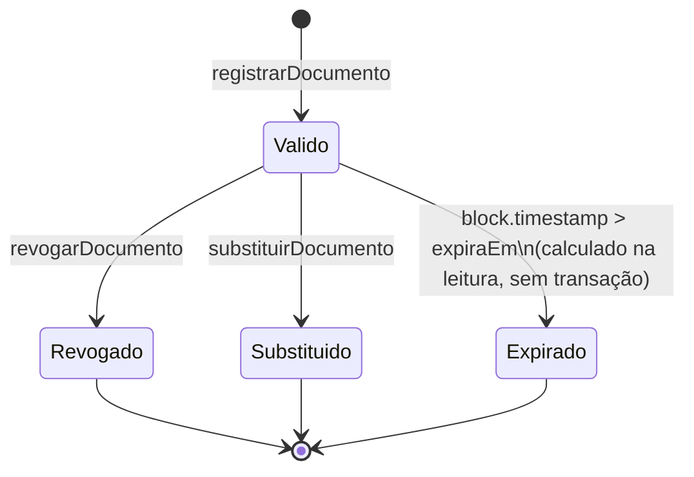

# Diagrama de Classes — Contratos Inteligentes

## 1. Diagrama

```mermaid
classDiagram
    class DocumentoSigilosoRegistry {
        -address vara
        -mapping~bytes32, RegistroDocumento~ registros
        +registrarDocumento(documentId, documentHash, expiraEm)
        +revogarDocumento(documentId)
        +substituirDocumento(documentIdAntigo, documentIdNovo, documentHashNovo, expiraEmNovo)
        +consultarStatus(documentId) StatusDocumento
        +obterRegistro(documentId) RegistroDocumento
        +transferirVara(novaVara)
    }

    class RegistroDocumento {
        +bytes32 documentHash
        +address emissor
        +uint64 emitidoEm
        +uint64 expiraEm
        +StatusDocumento status
        +bytes32 substituidoPor
        +bool existe
    }

    class StatusDocumento {
        <<enumeration>>
        Valido
        Expirado
        Revogado
        Substituido
    }

    DocumentoSigilosoRegistry "1" --> "*" RegistroDocumento : armazena em `registros`
    RegistroDocumento --> StatusDocumento : possui
```

## 2. Máquina de estados de `StatusDocumento`

```mermaid
stateDiagram-v2
    [*] --> Valido: registrarDocumento
    Valido --> Revogado: revogarDocumento
    Valido --> Substituido: substituirDocumento
    Valido --> Expirado: block.timestamp > expiraEm\n(calculado na leitura, sem transação)
    Revogado --> [*]
    Substituido --> [*]
    Expirado --> [*]
```